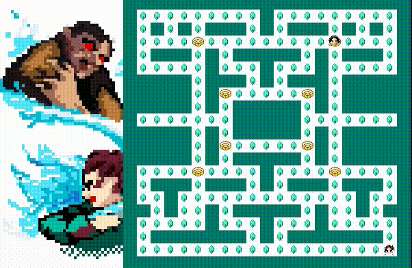
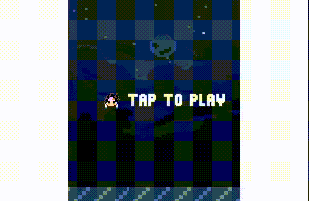

# Игра по мотивам аниме "Клинок рассекающий демонов".

## Подготовка к использованию
1) Если у вас не установлен python3:
https://tkdocs.com/tutorial/install.html#install-x11-python

Также необходима библиотека pygame
``` shell
pip install pygame
```
2) Скопируйте в командную строку:
``` shell
git clone https://github.com/SofiMi/Clicker.git
cd GameDemonSlayer 
python3 main.py
```

## Описание
Открывая игру, вы попадаете во вселенную DemonSlayer. В этом мире вам предстоит сражаться со множеством демонов, прокачивать скины, а также победить 2-x великих лун.
(*луна в данном аниме - могущественный демон, испивший кровь Мудзан Кибуцуджи*)


Основная часть игры представляет собой кликер, где вы можете убивать демонов множественным нажатием мыши. За это вы получаете очки, которые можно потратить на покупку персонажей и магических предметов.

В игре также присутсвуют достижения, которые можно разбить на несколько групп.
 - за количество убитых демонов
 - за итоговую силу игрока
 - за победу над высшими лунами
 Их можно найти в соотвествующем разделе игры.

### Мини-игры
**Кегай** - демон, известный своими магическими барабанами, которые изменяют пространство. Вам необходимо разобраться в местности, собрать алмазы прежде, чем он вас настигнет.

Это адаптация известной игры Pacman, где злодей каждые 15 секунд рандомно перемещается к точки, отмеченные на карте (*при желании в коде можно изменить количество врагов, но игра значительно усложняется*).



**Даки** - могущественный демон, способный создавать тысячи поясов. 
Уклонитесь от них всех, как в игре FlappyBird.




